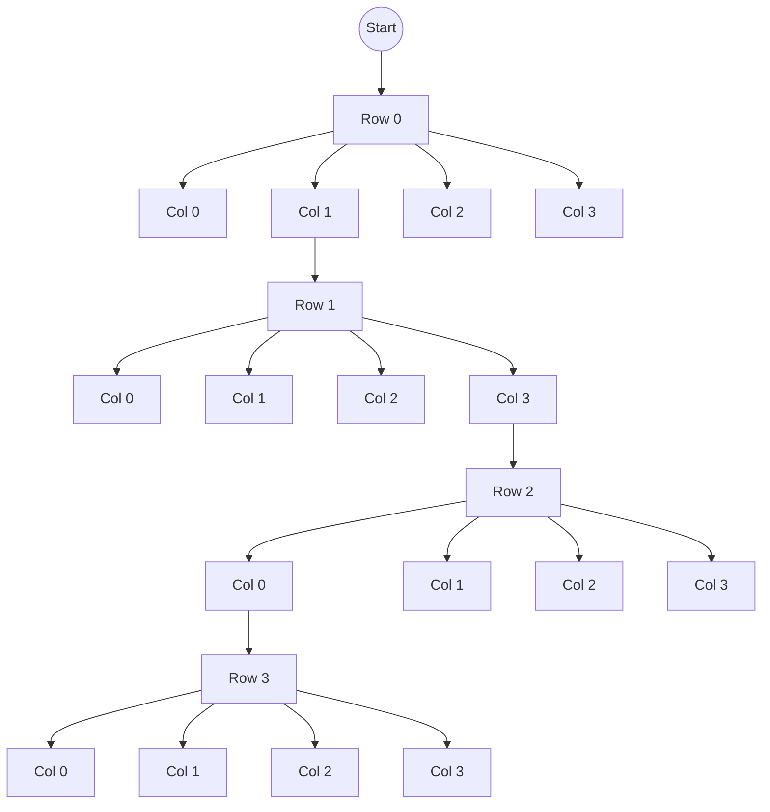

# Backtracking

Backtracking is an algorithmic technique for solving search and decision problems by building solutions incrementally and abandoning (backtracking from) branches that do not satisfy the constraints. It is a systematic way of traversing the solution space using recursion and pruning whenever a partial state cannot lead to a valid solution.

## Basic idea

- A solution is built step by step; at each step one option (a candidate) is chosen to extend the partial solution.
- After adding an option, it is checked whether the partial solution is still valid (meets the constraints). If it is not, the option is undone (backtrack) and the next one is tried.
- If the partial solution reaches the final state (complete), it is recorded as a solution.

In essence, backtracking is a DFS (depth-first search) over the decision tree, combining candidate generation and constraint checking to prune useless branches.

## General structure (pseudocode)

```pseudocode
function backtrack(partial_solution):
    if partial_solution is complete:
        record(partial_solution)
        return
    for candidate in generate_candidates(partial_solution):
        if valid(partial_solution, candidate):
            add(partial_solution, candidate)
            backtrack(partial_solution)
            remove(partial_solution, candidate)  // backtrack
```

## Examples of problems that use backtracking

- The N-Queens problem
- Generating permutations and combinations
- Subset sum
- Graph coloring with k colors
- Sudoku and other constraint-based puzzles

## Complexity

Complexity depends on the size of the search space and the effectiveness of pruning. In the worst case (without pruning) the time can be exponential in the depth of the solution. However, smart pruning drastically reduces the work in many practical cases.

## Pruning and optimization techniques

- Early validation: check constraints as soon as possible to abandon branches early.
- Heuristic ordering: choose the most promising candidates first (e.g., the MRV heuristic in CSPs).
- Forward checking and constraint propagation: update variable domains before recursing.
- Backjumping and conflict learning: skip several levels when a conflict is detected, or memorize failures.
- Use of efficient structures to verify constraints (sets, bitmasks, tables).

## Didactic example in Python (generating permutations with backtracking)

The following example generates all permutations of a list using an explicit backtracking approach (without using `itertools.permutations`), to illustrate incremental construction and backtracking.

```python
def permutations_backtrack(nums):
    result = []
    n = len(nums)
    used = [False] * n

    def backtrack(path):
        if len(path) == n:
            result.append(path.copy())
            return
        for i in range(n):
            if used[i]:
                continue
            used[i] = True
            path.append(nums[i])
            backtrack(path)
            path.pop()
            used[i] = False

    backtrack([])
    return result

# Usage
print(permutations_backtrack(['a', 'b', 'c']))
```

Quick explanation of the example:

- `path` is the partial solution; `used` prevents reusing the same element.
- At each level we try choosing an unused element, recurse, and then undo the choice (`pop` and setting `used[i] = False`).

## Best practices

- Design an efficient validity check to cut branches early.
- Apply heuristics when the search space is large.
- Avoid copying complete structures on every call; use in-place modifications and revert them when backtracking.
- If the problem allows it, combine backtracking with dynamic programming or memoization to avoid repeating subproblems.

## Conclusion

Backtracking is a flexible and powerful technique for combinatorial problems with constraints. Its practical success depends on the ability to prune the search tree effectively and to apply heuristics that prioritize promising decisions.

---

## Complete example: N-Queens (Python)

The N-Queens problem consists of placing N queens on an N×N board so that none attacks another. It is a classic problem solved efficiently with backtracking and pruning using auxiliary structures to detect conflicts.

```python
def solve_n_queens(n):
    solutions = []
    cols = set()
    diag1 = set()  # r - c
    diag2 = set()  # r + c
    board = [-1] * n  # board[r] = c

    def backtrack(r):
        if r == n:
            # Build a readable representation
            sol = []
            for c in board:
                row = ['.'] * n
                row[c] = 'Q'
                sol.append(''.join(row))
            solutions.append(sol)
            return
        for c in range(n):
            if c in cols or (r - c) in diag1 or (r + c) in diag2:
                continue
            # choose
            board[r] = c
            cols.add(c); diag1.add(r - c); diag2.add(r + c)
            backtrack(r + 1)
            # undo (backtrack)
            board[r] = -1
            cols.remove(c); diag1.remove(r - c); diag2.remove(r + c)

    backtrack(0)
    return solutions

# Example usage: print solutions for N=4
if __name__ == '__main__':
    sols = solve_n_queens(4)
    print(f"Found {len(sols)} solutions for N=4")
    for s in sols:
        print('\n'.join(s))
        print()
```

Explanation:

- `cols`, `diag1`, and `diag2` allow checking in O(1) whether placing a queen at `(r,c)` creates a conflict.
- `board` stores the column of the queen in each row and is updated in-place; it is restored when backtracking.
- Pruning avoids exploring configurations that already violate constraints.

## Decision tree diagram (Mermaid)

The following diagram shows a fragment of the decision tree for `N=4`. Each level corresponds to a row and the branches to the possible columns; the crossed-out branches would represent placements rejected because of a conflict.



Notes:

- The diagram is a simplified sketch and does not show the explicit prunes (branches discarded due to conflict), but it illustrates the layered structure of the decision tree.
- In real implementations, pruning reduces the effective size of the tree a lot.
