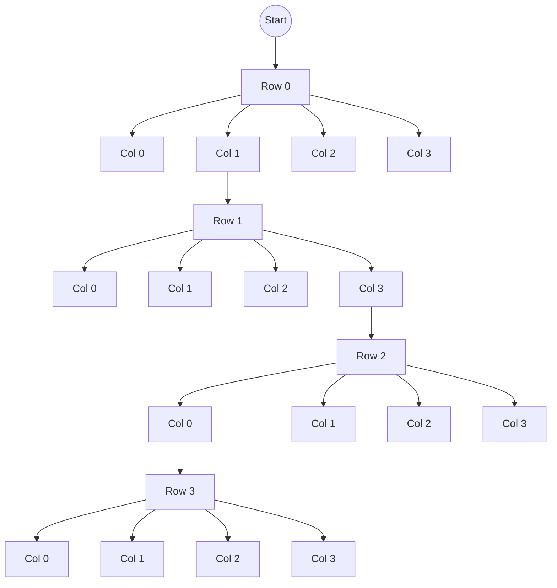

# Backtracking

El backtracking (retroceso) es una técnica algorítmica para resolver problemas de búsqueda y decisión construyendo soluciones incrementales y abandonando (retrocediendo) aquellas ramas que no cumplen las restricciones. Es una forma sistemática de recorrer el espacio de soluciones usando recursión y poda cuando un estado parcial no puede conducir a una solución válida.

## Idea básica

- Se construye una solución paso a paso; en cada paso se elige una opción (un candidato) para extender la solución parcial.
- Tras añadir una opción, se comprueba si la solución parcial sigue siendo válida (cumple las restricciones). Si no lo es, se deshace la opción (backtrack) y se prueba la siguiente.
- Si la solución parcial alcanza el estado final (completa), se registra como solución.

En esencia, backtracking es un DFS (depth-first search) sobre el árbol de decisiones, combinando generación de candidatos y comprobación de restricciones para podar ramas inútiles.

## Estructura general (pseudocódigo)

```pseudocode
function backtrack(sol_parcial):
    if sol_parcial es completa:
        registrar(sol_parcial)
        return
    for candidato in generar_candidatos(sol_parcial):
        if valido(sol_parcial, candidato):
            añadir(sol_parcial, candidato)
            backtrack(sol_parcial)
            quitar(sol_parcial, candidato)  // retroceder
```

## Ejemplos de problemas que usan backtracking

- Problema de las N reinas (N-Queens)
- Generación de permutaciones y combinaciones
- Sumas de subconjuntos (subset sum)
- Coloreo de grafos con k colores
- Sudoku y otros rompecabezas con restricciones

## Complejidad

La complejidad depende del tamaño del espacio de búsqueda y de la eficacia de la poda. En el peor caso (sin poda) el tiempo puede ser exponencial en la profundidad de la solución. Sin embargo, la poda inteligente reduce drásticamente el trabajo en muchos casos prácticos.

## Técnicas de poda y optimización

- Validación temprana: comprobar restricciones tan pronto como sea posible para abandonar ramas pronto.
- Orden heurístico: elegir primero candidatos más prometedores (p. ej. heurística MRV en CSPs).
- Forward checking y propagación de restricciones: actualizar dominios de variables antes de recursar.
- Backjumping y aprendizaje de conflictos: saltar varios niveles cuando se detecta un conflicto, o memorizar fallos.
- Uso de estructuras eficientes para verificar restricciones (sets, bitmasks, tablas).

## Ejemplo didáctico en Python (generar permutaciones por backtracking)

El siguiente ejemplo genera todas las permutaciones de una lista usando un enfoque explícito de backtracking (sin usar itertools.permutations), para ilustrar la construcción incremental y el retroceso.

```python
def permutations_backtrack(nums):
    result = []
    n = len(nums)
    used = [False] * n

    def backtrack(path):
        if len(path) == n:
            result.append(path.copy())
            return
        for i in range(n):
            if used[i]:
                continue
            used[i] = True
            path.append(nums[i])
            backtrack(path)
            path.pop()
            used[i] = False

    backtrack([])
    return result

# Uso
print(permutations_backtrack(['a', 'b', 'c']))
```

Explicación rápida del ejemplo:

- `path` es la solución parcial; `used` evita reutilizar el mismo elemento.
- En cada nivel se prueba elegir un elemento no usado, se recursa, y después se deshace la elección (`pop` y marcar `used[i] = False`).

## Buenas prácticas

- Diseñar una verificación de validez eficiente para cortar ramas pronto.
- Aplicar heurísticas cuando el espacio de búsqueda es grande.
- Evitar copiar estructuras completas en cada llamada; usar modificaciones in-place y revertirlas al retroceder.
- Si el problema admite, combinar backtracking con programación dinámica o memoización para evitar repetir subproblemas.

## Conclusión

El backtracking es una técnica flexible y poderosa para problemas combinatorios con restricciones. Su éxito práctico depende de la capacidad para podar eficazmente el árbol de búsqueda y de aplicar heurísticas que prioricen decisiones prometedoras.

---


## Ejemplo completo: N-Queens (Python)

El problema de las N reinas consiste en colocar N reinas en un tablero N×N de forma que ninguna ataque a otra. Es un clásico problema resuelto eficientemente con backtracking y poda usando estructuras auxiliares para detectar conflictos.

```python
def solve_n_queens(n):
    solutions = []
    cols = set()
    diag1 = set()  # r - c
    diag2 = set()  # r + c
    board = [-1] * n  # board[r] = c

    def backtrack(r):
        if r == n:
            # Construir representación legible
            sol = []
            for c in board:
                row = ['.'] * n
                row[c] = 'Q'
                sol.append(''.join(row))
            solutions.append(sol)
            return
        for c in range(n):
            if c in cols or (r - c) in diag1 or (r + c) in diag2:
                continue
            # elegir
            board[r] = c
            cols.add(c); diag1.add(r - c); diag2.add(r + c)
            backtrack(r + 1)
            # deshacer (retroceder)
            board[r] = -1
            cols.remove(c); diag1.remove(r - c); diag2.remove(r + c)

    backtrack(0)
    return solutions

# Ejemplo de uso: imprimir soluciones para N=4
if __name__ == '__main__':
    sols = solve_n_queens(4)
    print(f"Encontradas {len(sols)} soluciones para N=4")
    for s in sols:
        print('\n'.join(s))
        print()
```

Explicación:

- `cols`, `diag1` y `diag2` permiten comprobar en O(1) si colocar una reina en `(r,c)` genera conflicto.
- `board` almacena la columna de la reina en cada fila y se actualiza in-place; al retroceder se restaura.
- La poda evita explorar configuraciones que ya violan restricciones.

## Diagrama del árbol de decisiones (Mermaid)

El diagrama siguiente muestra un fragmento del árbol de decisiones para `N=4`. Cada nivel corresponde a una fila y las ramas a las columnas posibles; las ramas tachadas representarían colocaciones rechazadas por conflicto.



Notas:

- El diagrama es un esquema simplificado y no muestra las podas explícitas (ramas que se descartan por conflicto), pero ilustra la estructura en capas del árbol de decisiones.
- En implementaciones reales la poda reduce mucho el tamaño efectivo del árbol.
